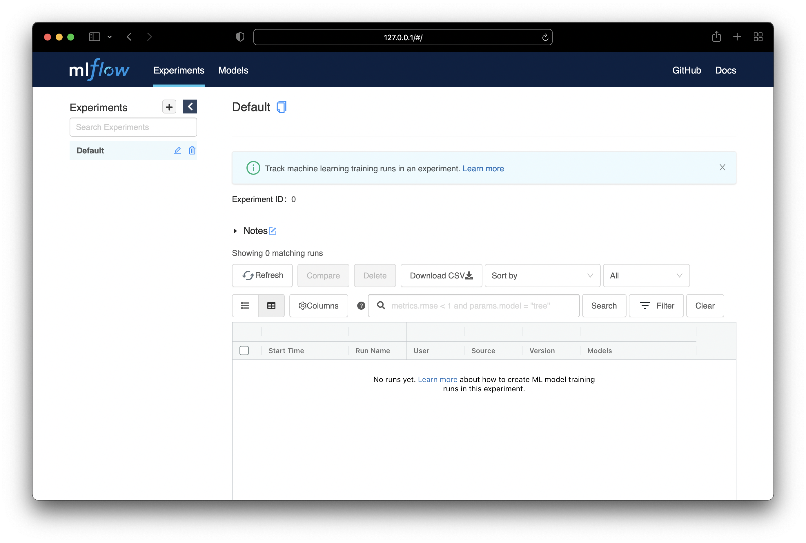

# mlflow


```
# Create .env with 
MYSQL_DATABASE=mlflow
MYSQL_USER=mlflow
MYSQL_PASSWORD=mlflow
MYSQL_ROOT_PASSWORD=mlflow
AWS_ACCESS_KEY_ID=
AWS_SECRET_ACCESS_KEY=
AWS_DEFAULT_REGION=
AWS_S3_BUCKET=s3://mlflow_bucket/mlflow/
NGINX_HTTP_AUTH_USER=mlflow
NGINX_HTTP_AUTH_PASSWORD=mlflow

# Start
docker-compose up -d --build 

# Stop
docker-compose down

# Stop & Clean
docker-compose down -v 
```

Access MLFlow
http://127.0.0.1/
u: mlflow
p: mlflow

